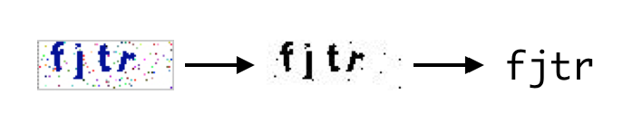

## verify

Easy sample to verify captcha by tesseract-ocr and gm.

## Dependences
Make sure you have the follow environment.

- [gm](https://github.com/aheckmann/gm#getting-started)
- [tesseract](https://github.com/desmondmorris/node-tesseract#installation)


## Getting Started

```bash
$ npm i git+ssh@github.com:cupools/verify.git
```

```js
import verify from 'verify'

verify('test/fixtures/fjtr.jpg')
  .then(function (txt) {
    console.log(txt)
    // => 'fjtr'
  })
```



## Test

```bash
$ npm i && npm test
```
